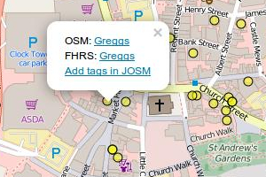

# [python-fhrs-osm](http://github.com/gregrs-uk/python-fhrs-osm)
Python tools for downloading and comparing Food Hygiene Rating Scheme (FHRS) and OpenStreetMap (OSM) data and finding possible matches between it, together with Leaflet slippy maps for visualising the data.

## Maps and statistics for Great Britain

Please follow the link for [FHRS comparison maps and statistics for Great Britain](http://gregrs.dev.openstreetmap.org/fhrs/), kindly hosted on the OpenStreetMap dev server and updated weekly.

## Features
* Download OpenStreetMap and FHRS data and parse it into a PostgreSQL/PostGIS database
* Use database views to compare OpenStreetMap and FHRS data and find anomalies, and to find possible matches between OSM nodes/ways and FHRS establishments based on proximity and similarity of names
* Export HTML pages with statistics and Leaflet slippy maps, allowing users to visualise OSM/FHRS data as well as to review possible matches between FHRS and OSM data and import useful tags into JOSM

## Requirements
* Requires PostGIS 2.3
* Tested using:
	- Ubuntu 16.04
	- Python 2.7
	- PostgreSQL 9.5
	- PostGIS 2.3 (installed using [PGDG package](https://wiki.postgresql.org/wiki/Apt))

## Installation
1. Download the Boundary Line shapefiles from
[Ordnance Survey](https://www.ordnancesurvey.co.uk/opendatadownload/) and
place the four `district_borough_unitary_region.*` files in the `shapefiles` directory. (These are used to compute which district FHRS establishments and OSM entities are in so that relavitely small GeoJSON files can be created, one for each district)
* Run `setup.sh`, which should:
    * Install overpy module
    * Install psycopg2 module
    * Install shapely module
    * (Re)create PostgreSQL database (called `fhrs` by default, see `config.py`)
    * Enable PostGIS and fuzzystrmatch extensions
    * Run `import_bline_districts.sh` to import district boundaries from shapefiles
    * Run `python get_fhrs_data.py` to download FHRS data and upload to the PostgreSQL database
        * By default, data for the Rugby and Warwick areas are downloaded, but this can be altered in `config.py`
        * FHRS data is downloaded one authority at a time
    * Run `python get_osm_data.py` to download OpenStreetMap data and upload to the PostgreSQL database
        * OSM ways are simplified to a single point at the center of the way.
        * By default, data is downloaded using Overpass API to match the bounding box of the FHRS data present in the database. The bounding box can be altered in `get_osm_data.py`
        * The OSM tag/value pairs to query can also be modified. Please see the docstrings in `fhrs_osm/__init__.py` for details
        * If OSM data for a large geographical area is required, it's best to filter a PBF file (e.g. one obtained from [GeoFabrik](http://download.geofabrik.de/europe/great-britain.html)) using `filter-osm.sh`. Set `use_xml_file=True` in `config.py` to parse the filtered file rather than querying Overpass API
    * Run `python process_data.py` to compute which district FHRS establishments and OSM entities are in and to create the database views
    * Run `python create_output_data.py` to create HTML and GeoJSON files for each district which contains more than a certain threshold of FHRS data

## Usage
* Open `html/index.html` in a browser to show a list of districts. Click on a district to show a page with statistics and maps (see below) for a particular district

## Overview map

Multiple establishments within approx. 3.5 metres of each other are aggregated. (This is especially necessary because the FHRS position data is reverse geocoded from postcodes.)
* Locations with at least one OSM entity with an `fhrs:id` value not present in the FHRS data table (e.g. establishments that have closed) or with a missing/mismatched postcode are **red**
* Locations with at least one OSM entity with no `fhrs:id` tag and no postcode are **orange**
* Locations with at least one OSM entity with no `fhrs:id` tag are **yellow**
* Locations containing at least one establishment from the FHRS database with no matching OSM entity (matched using `fhrs:id` tag) are **blue**
* Locations containing only OSM entities with a valid `fhrs:id` value and postcode are **green**

Clicking on a marker shows a popup with the name of any OSM entities or FHRS establishments and a link to the relevant OSM node/way or FHRS establishment web page. If the marker represents an OSM entity, the popup also includes a link which allows the user to edit the entity in JOSM

## Suggested matches map

By default, this map shows OSM entities with possible matches in the FHRS database, based on the following criteria:
* < 250m distance
* Either FHRS name contains OSM name within it or names are closely matched using Levenshtein distance algorithm

Clicking on a marker shows a popup with links to the OSM node/way web page and the FHRS establishment web page, as well as a link which allows the user to copy relevant tag/value pairs into JOSM

## Copyright

Copyright &copy; [gregrs-uk](http://github.com/gregrs-uk/) 2016, published under the GNU GPL v3.0
